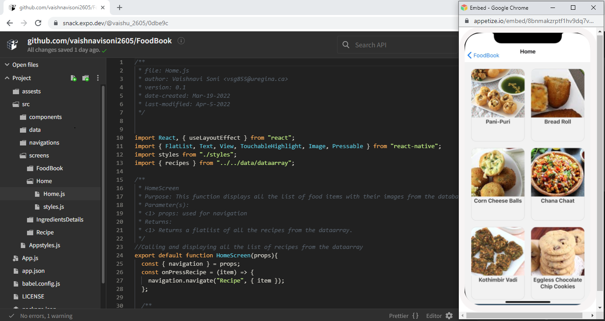
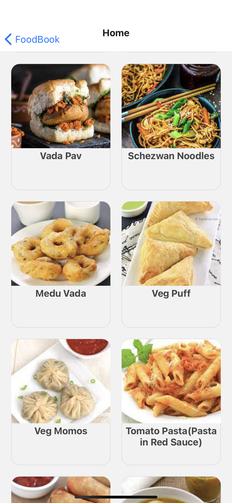
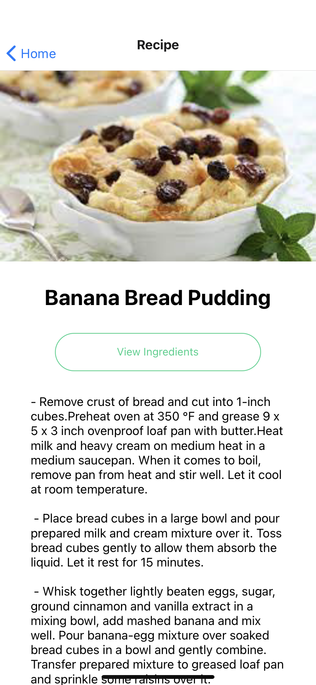
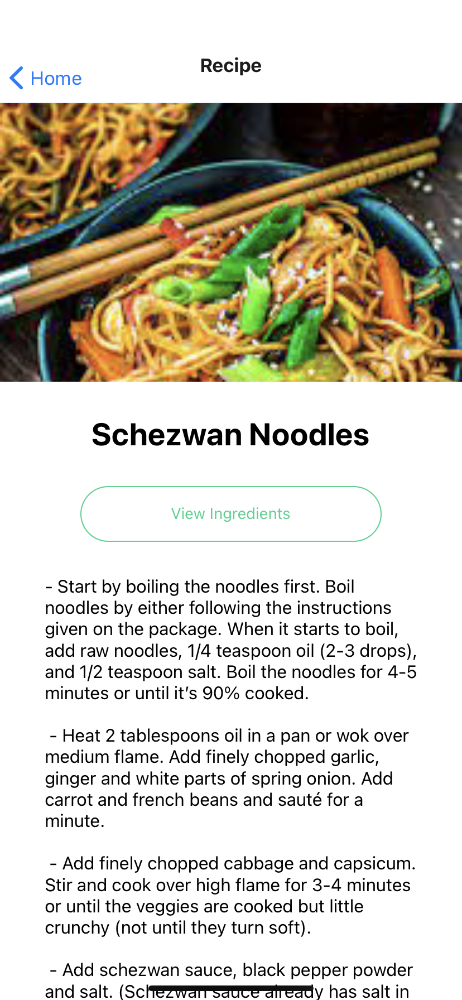
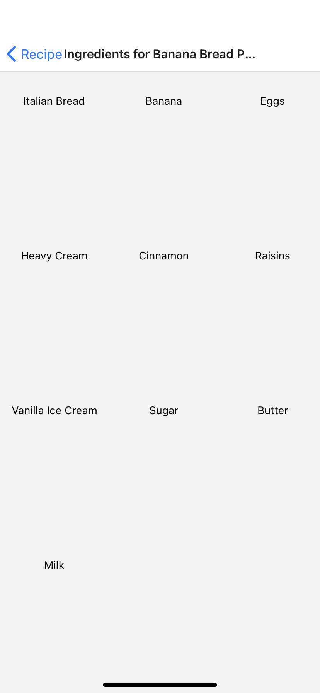
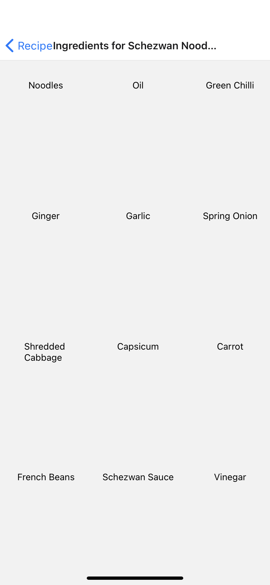

# FoodBook 

  

## Content 
- [Introduction](#introduction)
- [Getting Started](#getting-started)
- [Expo Demo](#expo-demo)
- [App Features](#app-features)
- [App Preview](#app-preview)
- [Screens](#screens)
    - [FoodBook Screen](#foodbook-screen)
    - [Home Screen](#home-screen)
    - [Recipe Screen](#recipe-screen)
    - [Ingredients Details Screen](#ingredients-details-screen)

- [Files](#files)
    - [Components](#components)
    - [Screens](#screens)
    - [Data](#data)
    - [Navigations](#navigations)
- [Building App Instructions](#building-app-instructions)
- [Contributing](#contributing)
- [Contact Author](#contact-author)
- [References](#references)
- [Licence](#licence)
- [Acknowledgements](#acknowledgements)

## Introduction
FoodBook is the application where you can find step by step recipes for different vegetarian dishes with the ingredients list. The goal of creating this software was to tackle the problem of people who move to various countries for  their carrier or studies and don't know how to cook. With this app, they can simply learn how to cook. Moreover, this is my final project of my CS 855 Mobile Computing class where we have to build an react application.

## Getting Started
To clone this project on Expo Dev just copy the link of the code from the code section and clone it into the new snack in expo dev.

This project is built using expo so to run this app locally:
1. Install the latest Node
2. Install [Expo](https://expo.io/) - `npm install expo-cli --global`
3. `cd` into this project directory
4. `npm install` or `yarn install`
5. Run `expo start`

To clone this app in your local machine simply download the zip file or copy the link. 

## Expo Demo
Scan the below OR code in Expo Client App to open project on IOS.

To run this application on android devices there are some changes to make in the code as I have used IOS styling e.g., Fontfamily. 

## App Features
- Recipes list
- Step by Step process of recipes
- Photos
- Ingredients List

## App Preview
Short Preview of my application

## Screens
### FoodBook Screen
The main page of the application

### Home Screen
Home Screen consists of all the recipes available on the app

  

### Recipe Screen
When user click on any food item on the home screen it will take the user to recipe screen. Here the user can find detailed recipe of that food item.

  
    
### Ingredients Details Screen
On the recipe screen when the user click view ingredients button it will take the user to the ingredients details screen where all the ingredients used in that food item is listed.

  

## Files
### Components
`src/components/ViewIngredientButton/`
- `ViewIngredientButton.js` -  Consists the functionality of View Ingredients button in recipe screen.
- `styles.js` -  Provides styling to View Ingredients button.

### Screens
`src/screens/Home/`
- `Home.js` - Consists list of all the vegetarian recipes.
- `styles.js` - Provides styling to home page.

`src/screens/Recipe/`
- `Recipe.js` - Detailed recipe of the selected food item.
- `style.js` - Provides styling to recipe page.

`src/screens/IngredientsDetails/`
- `IngredientsDetails.js` - Detailed list of all the ingredients used of the selected food item.
- `styles.js` - Provides styling to ingredients page.

### Data
Previously my plan was to build a database in Firebase for my project but due to some issues I had to hard-code my database by myself. 

`src/data/`
- `dataarray.js` - Database of the project.
- `ingredientsdata.js` - Consists of functions to display ingredients list on the ingredients details page.

### Navigations
`src/navigations/`
- `AppNavigation.js` - Here the function MainNavigator which consists of all the screens is exported.

## Building App Instructions
To build a app with Expo checkout the installation instructions [here](https://docs.expo.dev/classic/building-standalone-apps/).

## Contributing

Due to time limit of the semester I have only implemented few features. There are many other features to develop this application as follows:
- Adding video tutorials of the cooking process.
- Sorting the food items into different categories.
- Recipes by ingredients.

Also any other suggestions for developing this application is always very welcome!

## Contact Author
[Vaishnavi Soni](https://github.com/vaishnavisoni2605)

[GitHub link to FoodBook project](https://github.com/vaishnavisoni2605/FoodBook)

## References

I have prepared my database with the help of [Food Viva](https://foodviva.com/).

## Licence

[MIT](https://github.com/vaishnavisoni2605/FoodBook/blob/main/LICENSE)

## Acknowledgements

Thanks to our professor Dr. Trevor Tomesh for given us a great guidance for the class CS 855 Mobile Computing through out the semester.

